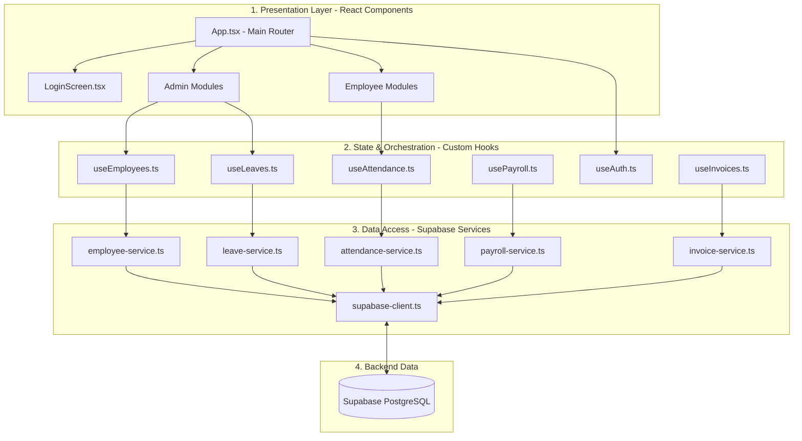
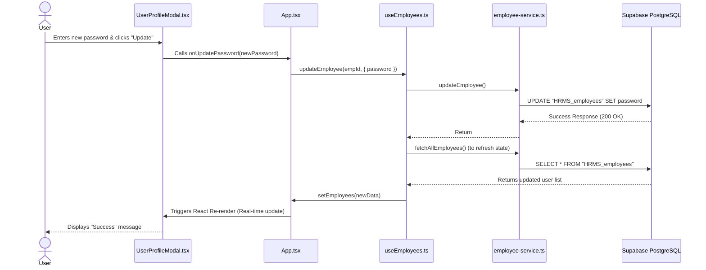

# HRMS System Architecture & Codebase Walkthrough

Welcome to the technical overview of the SMS Diagnostics HR Management System. This document breaks down the core architecture, design patterns, and critical files using diagrammatic models.

## 1. High-Level Architecture

The system follows a modern **3-Tier Frontend Architecture** using React, TypeScript, and Supabase. The application is designed to be highly modular, separating the UI from business logic and database interactions.

---

## 2. The Core Layers & Major Files

### Layer 1: Presentation (UI)
Located entirely in `src/components/`, this layer consists of React functional components styled with Tailwind CSS. It handles user interactions and renders data passed down from the Orchestration Layer.

> [!TIP]
> **Key Design Pattern:** **Conditional Rendering based on Role**. The `App.tsx` file acts as the central hub. It evaluates if the `currentUser.role` is `'admin'` or `'employee'` and mounts the respective components (e.g., `AdminDashboard.tsx` vs `DashboardSnapshot.tsx`).

**Major Files:**
- **[App.tsx](file:///c:/Users/adity/Downloads/hr-management-system/src/App.tsx):** The beating heart of the frontend. It holds global state (like active tabs and current user) and acts as a router, loading specific modules.
- **[LoginScreen.tsx](file:///c:/Users/adity/Downloads/hr-management-system/src/components/LoginScreen.tsx):** Handles the initial gateway, ensuring unauthorized users cannot access the router.
- **Employee Modules:** `DashboardSnapshot.tsx`, `CheckInModule.tsx`, `LeaveModule.tsx`, `PayrollModule.tsx`
- **Admin Modules:** `AdminDashboard.tsx`, `EmployeeDirectory.tsx`, `AdminLeaveApprovals.tsx`, `InvoiceModule.tsx`

---

### Layer 2: Orchestration (Custom Hooks)
Located in `src/hooks/`, these files encapsulate React state (`useState`, `useEffect`) and bind the UI to the database services. They ensure the UI re-renders automatically when data changes.

**Major Files:**
- **[useEmployees.ts](file:///c:/Users/adity/Downloads/hr-management-system/src/hooks/useEmployees.ts):** The most critical hook. It fetches the global employee array, and exposes functions like `updateEmployee`, `addEmployee`, etc.
- **[useLeaves.ts](file:///c:/Users/adity/Downloads/hr-management-system/src/hooks/useLeaves.ts):** Exposes `approveLeave` and `rejectLeave`. Notice how it wraps the service call, and then immediately triggers a `loadData()` refresh so the UI updates instantly.

---

### Layer 3: Data Access (Services)
Located in `src/lib/services/`, this layer contains **pure TypeScript functions** (no React code). It is strictly responsible for executing queries against the Supabase database.

> [!IMPORTANT]
> **Key Design Pattern:** **Local Fallback Mode**. If the Supabase database goes offline or schema columns are missing, these services are designed to catch the errors and gracefully fall back to local storage processing. This ensures the app never completely crashes for the user.

**Major Files:**
- **[supabase-client.ts](file:///c:/Users/adity/Downloads/hr-management-system/src/lib/supabase-client.ts):** Initializes the secure connection to the PostgreSQL database using your Environment Variables (`VITE_SUPABASE_URL`).
- **[employee-service.ts](file:///c:/Users/adity/Downloads/hr-management-system/src/lib/services/employee-service.ts):** Contains raw SQL-like statements such as `supabase.from('HRMS_employees').update(...)`.
- **[leave-service.ts](file:///c:/Users/adity/Downloads/hr-management-system/src/lib/services/leave-service.ts):** Handles complex transactions, like approving a leave and simultaneously updating the `HRMS_leave_balances` table.

---

## 3. Data Flow Example: Changing a Password

To understand how the system fits together, here is the exact sequence of events when an employee changes their password:

### Summary of System Robustness
- **Strict Typing:** Managed in `src/types.ts`, ensuring that whenever an employee object is passed around, TypeScript enforces it has the exact fields (like `basic_pay` or `leaveBalance`).
- **Localization:** The `translations.ts` file acts as a dictionary. The entire UI reads from this file based on a global `language` state ('en' or 'te'), allowing instant dynamic translation without refreshing the page.
